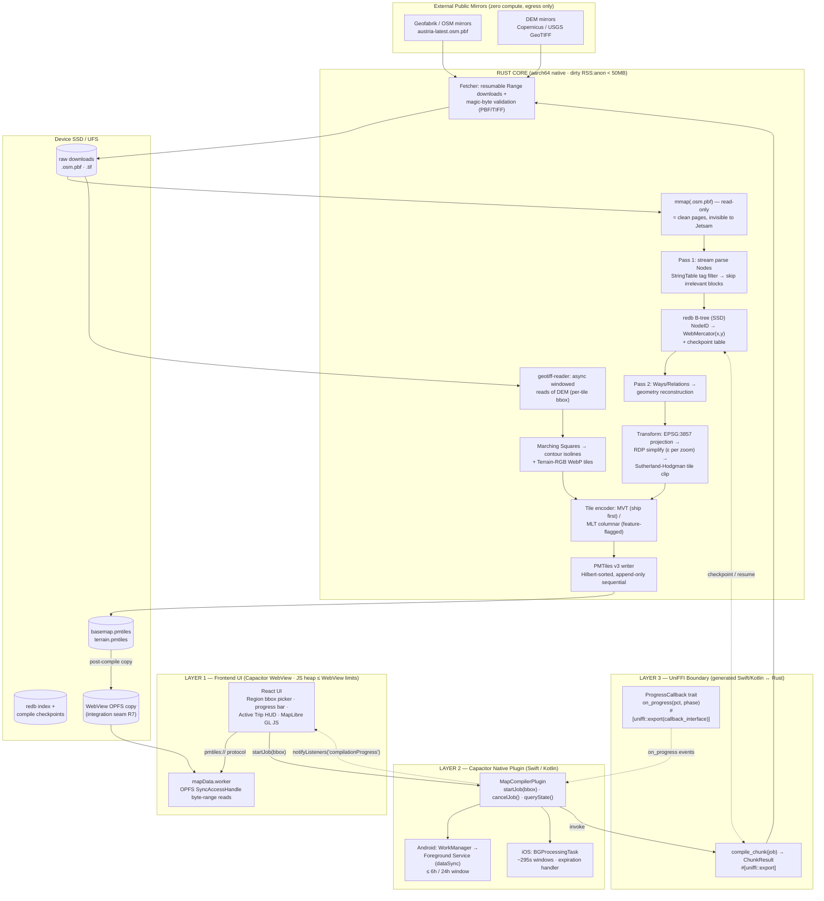

# On-Device Map Compilation: Feasibility, Architecture, and Implementation Plan

> Written by Claude (Fable 5) for the FreeHike "Zero-Cost Edge-Compute Paradigm" pivot, based on:
> - `Client-Side Map Compilation Feasibility.pdf`
> - `On-Device Map Compiler Blueprint.pdf`
>
> Cross-checked against the existing FreeHike codebase (Capacitor + React + MapLibre GL JS + OPFS,
> `scripts/compile_sandbox_data.sh`, and the Innsbruck/Tyrol fixture data already in
> `offline_sandbox/`).

---

## 1. Prospect Assessment

### Verdict

**Technically viable, but this is the hardest possible version of this product.** Both source
documents converge on the same conclusion, and it holds up: the architecture works *only* if
every pillar is respected simultaneously — native Rust (no WASM), mmap + stream parsing (no
in-memory graph), idempotent checkpointing (no monolithic run), and sequential PMTiles writes (no
SQLite container). Miss any one and the OS kills you, the flash suffers, or the thermals melt the
schedule. The docs' framing of "Compute Once on Server" being the superior UX is correct — a 50MB
CDN download beats a 30-minute on-device compile every time a user is *able* to use it. This
pivot is justified by the zero-cost constraint, not by UX. Go in with eyes open.

### Biggest technical risks, ranked

**R1 — iOS background execution is the schedule-killer, not memory (High).** The ~295-second
`BGProcessingTask` window is real, but the worse problem is that iOS fires it *opportunistically*
— idle, charging, cool. A 700MB Alps compile needing 20–60 min of CPU means 5–15 windows that iOS
may spread across an entire night, or not grant at all if the user doesn't charge. The honest UX
is "queue the region; it'll be ready after an overnight charge." Any design that promises
"compiling… 4 min remaining" on iOS will be a lie. Android's Foreground Service is far more
tractable but still capped (~6h/24h for `dataSync`) and at the mercy of OEM battery killers.

**R2 — Flash storage degradation and write amplification (High).** One compile plausibly writes:
700MB raw PBF + a redb node index (hundreds of MB–GB of B-tree churn) + intermediate tile stores
+ the final archives. With NAND write amplification, a single region could cost several GB of
physical writes; a user who recompiles regions frequently could push tens of GB. Mitigations that
must be non-negotiable: batch redb commits coarsely (one commit per PBF block group, never per
node), purge intermediates aggressively, write the final archive strictly sequentially, and
*cache compiled regions permanently* so recompiles are rare. Also add a storage preflight — the
transient footprint (~2.5–3.5GB for an Alps-scale region) will simply fail on nearly-full devices.

**R3 — Thermal throttling turns minutes into hours (High).** Passively-cooled SoCs will throttle
under sustained rayon saturation, and a throttled compile draws battery longer for less work. Cap
the pool to performance cores minus 2–3 (as the blueprint suggests), and go further: poll
`ProcessInfo.thermalState` / Android `THERMAL_STATUS` and *voluntarily* downshift to 1–2 threads
at `.serious`. A slower, cooler compile finishes sooner than a hot one.

**R4 — MLT maturity (Medium, and I'd push back on the plan here).** The "up to 6x" figure is the
best case on dense zoom levels; typical gains over *gzipped* MVT are more modest. More
importantly, MLT's value depends entirely on the renderer decoding it — and our renderer is
MapLibre GL JS inside the WebView reading through our custom PMTiles protocol. If MLT decode
support in that path is anything less than rock-solid, we ship broken maps to save disk we didn't
need to save. **Recommendation: build the encoder behind a format flag, ship MVT+gzip first, flip
to MLT when a golden-fixture render test passes.** The pipeline is identical either way; only the
final encode stage changes.

**R5 — Public mirror fragility (Medium — and we have scar tissue here).** This project has
*already* been burned twice by exactly this failure mode: Geofabrik has no
`austria/tirol-latest.osm.pbf` (the URL 302s to their homepage, which `curl -L` happily saved as
a "successful" download), and the committed 9.6KB HTML-as-PBF poisoned the pipeline for weeks.
On-device, this same failure hits end users. The native downloader must treat mirrors as hostile:
magic-byte validation (`OSMHeader` blob / TIFF magic), Content-Length sanity, resume via Range
requests, and a bounded mirror list with fallbacks. Also note Geofabrik is a donation-run service
— pointing a consumer app's full userbase at it raises an etiquette/rate-limit problem the docs
don't address. Budget for hosting a *dumb static mirror* (cheap egress-only, no compute) or using
multiple mirrors.

**R6 — Architectural discrepancy between the two docs (Medium, resolve now).** The Feasibility
report concludes React Native JSI is "the only viable path"; the directive specifies Capacitor +
UniFFI. These are compatible in practice — JSI's advantage (zero-copy synchronous JS↔native
calls) is irrelevant here because *no bulk data ever crosses the JS boundary*: JS sends a bbox
and receives progress events. Capacitor's plugin bridge is entirely adequate for that traffic.
I'm flagging it so nobody reads the feasibility doc later and relitigates the framework. Staying
on Capacitor also preserves the entire existing FreeHike WebView app.

**R7 — The OPFS seam (Medium, specific to *our* codebase, unaddressed by either doc).** Today,
`MapView` reads tiles via `WorkerPMTilesSource` → `mapData.worker` → OPFS `SyncAccessHandle`.
Natively-compiled archives will land in the app sandbox filesystem, which is *not* OPFS. Two
options: (a) stream-copy finished archives into OPFS post-compile (simple, doubles storage
transiently, keeps all existing web code unchanged), or (b) add a `MAP_READ_BYTES` native path so
the worker's byte-range reads hit the native file directly. Start with (a), migrate to (b) if
storage pressure demands.

**R8 — App Store review (Low-Medium).** Long-running background compute is exactly what Apple's
guidelines squint at. Using `BGProcessingTask` honestly (not location/audio keep-alive hacks — the
blueprint rightly warns these risk rejection) should pass, but plan review time and have the
"foreground compile with screen-on progress" mode as the fallback story.

---

## 2. Architectural Markup

Key properties encoded in the diagram: bulk data **never crosses the JS bridge** (only a bbox
down, progress events up); the raw PBF enters memory only as **clean mmap pages**; every arrow
into `REDB`/`OUT` is a disk write designed to be either batched or sequential; and the checkpoint
loop between the Rust core and the schedulers is what survives the 295-second iOS guillotine.

---

## 3. Master Implementation Plan

**Guiding rule for the whole plan: desktop-first.** Every phase of the Rust core is built and
validated as a plain CLI on macOS against our existing fixtures
(`offline_sandbox/raw_data/innsbruck.osm.pbf`, 19.5MB, 29,558 paths / 5,231 `sac_scale` ways;
`innsbruck_dem.tif`) before it ever touches a device. This eventually *replaces*
`scripts/compile_sandbox_data.sh` (Planetiler + massif), giving us one pipeline for dev and
production — and we already know what "correct" output looks like because the current app
renders it.

### Phase 0 — Scaffolding & golden fixtures (≈1 wk)
Cargo workspace `freehike-core/` (crates: `compiler`, `pbf`, `terrain`, `tiles`, `ffi`);
toolchains for `aarch64-apple-ios`, `aarch64-linux-android` + NDK; CI building all targets; a
golden-fixture test that compiles the Innsbruck extract and asserts tile counts/bboxes against
the current Planetiler output.
**Exit:** `cargo test` green on 3 targets; CLI skeleton runs on the Mac.

### Phase 1 — UniFFI bridge walking skeleton (≈1–2 wk)
`#[uniffi::export]` on a trivial `echo`/`version` API + a `ProgressCallback` callback interface.
Build the `.xcframework` (SPM, per Capacitor 8) and Android `.so`; write the `MapCompilerPlugin`
(Swift `CAPPlugin`, Kotlin) exposing `startJob/cancelJob/queryState` and forwarding Rust
callbacks to `notifyListeners('compilationProgress')`. Wire a hidden debug button in the React
app.
**Exit:** tap in WebView → Rust round-trip → progress event rendered in JS, both platforms.

### Phase 2 — Native fetcher with hostile-mirror hardening (≈1 wk)
Resumable Range-request downloader in Rust; validation before anything is trusted: PBF
`OSMHeader` blob check, TIFF magic, Content-Length sanity, checksum where mirrors publish one.
Mirror list with fallback. This encodes the Geofabrik-redirect lesson permanently.
**Exit:** kill-and-resume download test passes; corrupted/HTML payloads rejected with typed
errors surfaced to the UI banner system we already built.

### Phase 3 — Pass 1: mmap stream parse → redb (≈2 wk)
mmap the PBF read-only; stream PrimitiveBlocks (`osmpbf`/`rosm_pbf_reader`); StringTable
pre-filter to skip blocks lacking `highway`/`sac_scale`/`waterway`/etc.; project coordinates and
write `NodeID → (x,y)` to redb in coarse batched commits. Instrument dirty memory (`RSS:anon`) as
a first-class test metric with a hard 50MB CI gate; add iOS Increased-Memory/Extended-Virtual-
Addressing entitlements.
**Exit:** full Austria PBF (767MB, cached from our pipeline work) indexes on-device under the
memory gate.

### Phase 4 — Pass 2: geometry reconstruction + transform (≈2 wk)
Second stream pass over Ways/Relations; redb lookups to materialize geometries one at a time
(drop after encode); RDP simplification with per-zoom ε; Sutherland-Hodgman clipping to tile
bounds + buffer; tile binning into an on-disk intermediate store partitioned by Hilbert ID.
**Exit:** CLI output geometry diff vs. Planetiler golden fixtures within tolerance.

### Phase 5 — Encoding + PMTiles assembly (≈1–2 wk)
MVT encode (`fast-mvt`-style, ZigZag command integers) + gzip; Hilbert-sorted sequential append
via `pmtiles2` with tile-hash deduplication. MLT encoder behind a `--format=mlt` flag, **not**
default (per R4); a render-verification harness (headless MapLibre) gates the flag flip.
**Exit:** CLI-produced `basemap.pmtiles` renders correctly in the existing FreeHike app when
dropped into `public/local/`.

### Phase 6 — Terrain pipeline (≈1–2 wk)
`geotiff-reader` windowed reads (never whole-raster); Terrain-RGB WebP tiles matching what our
app already consumes (`mapbox` encoding, the massif parameters: base −10000, interval 0.1, r=3,
z5–12) → `terrain.pmtiles`; optional Marching-Squares contour vectors folded into the basemap.
Note our client already generates contours at runtime from the terrain archive via
maplibre-contour — decide then whether to keep runtime generation (less compile work) or bake
contours (less runtime CPU on-trail).
**Exit:** compiled terrain archive drives the existing 3D terrain/hillshade/contours
indistinguishably from the massif-built one.

### Phase 7 — Idempotent state machine (≈2 wk)
Checkpoint table in redb: `(job_id, phase, last_block_offset / last_hilbert_chunk,
bytes_written)`. Public API becomes `compile_chunk(budget_secs) → Finished | Yielded(state)`.
Torture tests: `kill -9` at random points, resume, assert byte-identical output vs. uninterrupted
run.
**Exit:** 100 random-kill resume cycles, zero corruption, no duplicated work beyond one chunk.

### Phase 8 — Background schedulers + thermal governance (≈2 wk)
Android: WorkManager → Foreground Service (`dataSync`, persistent notification), chunked loop
until done. iOS: `BGProcessingTask` (`requiresExternalPower`,
`requiresNetworkConnectivity=false` after download), expiration handler → flush + yield inside
~285s soft budget, re-submit task. Rayon `ThreadPoolBuilder` capped to P-cores−2; thermal-state
polling downshifts concurrency. Honest UX copy: iOS shows "will compile while charging."
**Exit:** full Alps-region compile completes overnight on a physical iPhone and mid-tier Android
without a single OS kill; device temperature stays out of `critical`.

### Phase 9 — Product integration (≈1–2 wk)
Region picker drawing a bbox on the existing map → `Compiler.startJob`; progress into the HUD; on
completion, stream-copy archives into OPFS (option (a) from R7) and invoke the already-built
`OfflineRegionSwitcher.loadOfflineRegion()` — that hot-swap path exists and works today. Storage
preflight + "delete region" management UI.
**Exit:** end-to-end: pick bbox → download → background compile → map renders the new region
fully offline.

### Phase 10 — Hardening & release (≈2 wk)
Flash-write budget telemetry (bytes written per compile), intermediate purge verification, mirror
etiquette (User-Agent, backoff, optional static mirror), App Store review dry-run with the
foreground-compile fallback mode, kill-switch remote config to disable on-device compilation if a
fleet problem emerges.

**Total: ~14–18 engineering weeks** for one engineer comfortable in Rust + both mobile platforms;
meaningfully parallelizable after Phase 1 (terrain and vector pipelines are independent).

---

## Process note

Nothing in this plan touches the current working app until Phase 9 — the WebView app, OPFS
provisioning, and region-switcher already built remain the stable base, and the Rust CLI replaces
the desktop build script (`scripts/compile_sandbox_data.sh`) long before it ships inside the
mobile binary.
